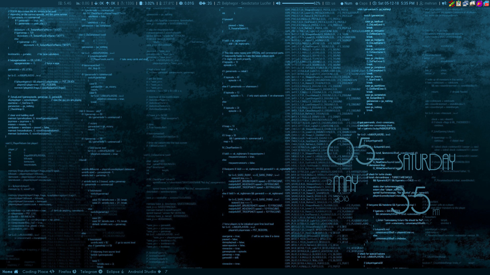
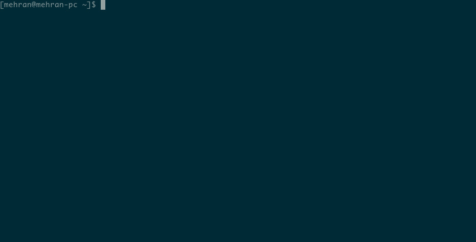
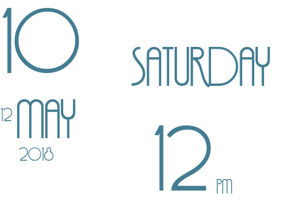
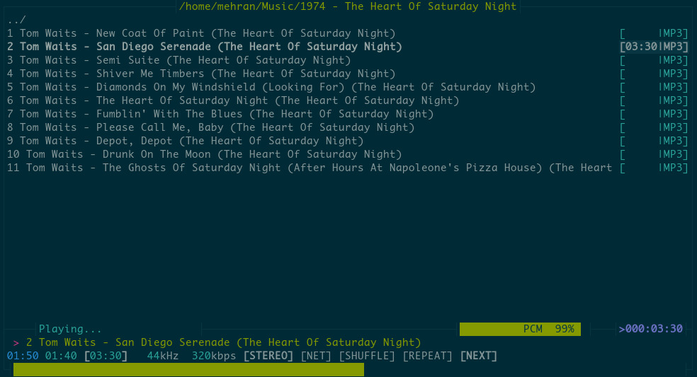
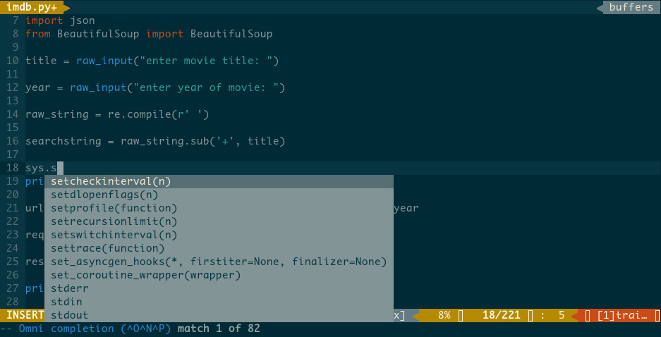
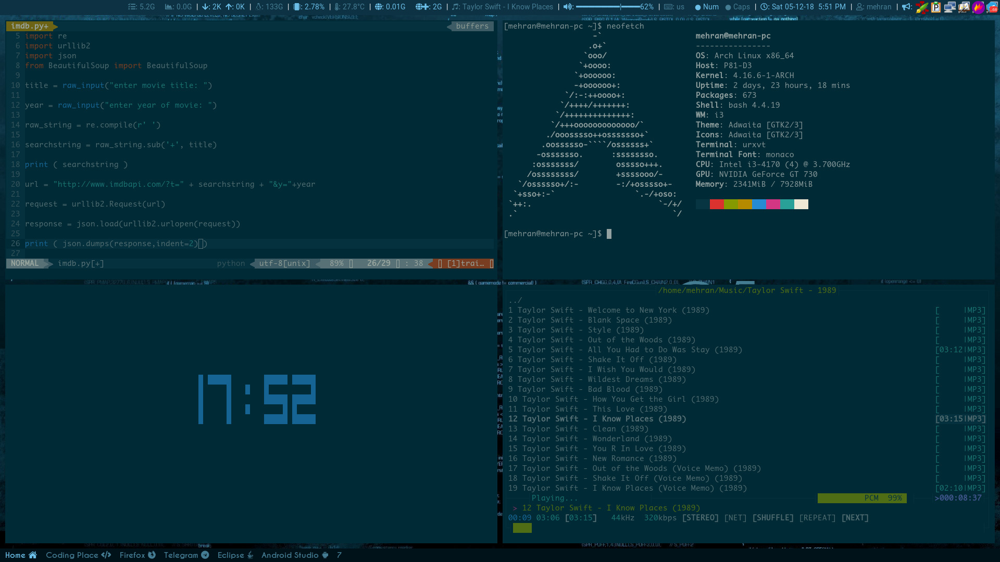

# Solarized Config for i3 Window Manager
## A Simple and Beautiful i3wm Config.
This is a Config collection for i3wm and some other applications like Vim or Conky!

Screenshot:

# Installation
This config is made for Arch Linux. but if you can find the requipments in other distribution's repository, You can use this, too!

first of all clone this repository to your computer with this command (needs git package):

`git clone https://github.com/mehranzolghadr666/i3wmsolarized.git`

## Requirements

Note: this names is name of packages in arch linux repositories. so if you're using arch linux, just copy it and paste it after `sudo pacman -S`

You can find The list of requirements in the requirements file in the main folder of this repository. However i'll write name of those packages you'll need to use this config.:

`13-gaps i3blocks i3lock flameshot conky rxvt-unicode dmenu xorg-setxkbmap nm-applet feh parcellite compton notfiy-osd bc moc ttf-font-awesome xorg-xrdb alsa-utils xorg-xprop xorg-xwininfo`

also you should install this packages from AUR:

`ttf-monaco ttf-vazir caviar-dreams xkblayout-state`

## i3wm

This config uses i3 gaps instead of i3wm because it's more Beautiful !

for install the Window Manager Config, just copy `config/i3` to `~/.config/` . 

## i3blocks

I've used i3blocks for show my computer's different sections status in a bar at the top of the screen.
also I've written some scripts to add more possibilities to i3blocks or improve Its default features.

so if you wanna use them, just copy `config/i3blocks` to `~/.config` .

also I use another bar to show my workspaces status, but It doesn't use i3blocks. so the i3blocks config isn't related to this bar.

## Xresources
all of the config of rxvt terminal emulator is in Xresources file. I used monaco font and Solarized color theme for my Terminal. 

for use this Xresources file just copy `Xresources/Xresources` as `~/.Xresources` and then run `xrdb -load ~/.Xresources` . 

## Conky
I've edited bioshock2 Conky to look better with my i3 config. 

if you like use my edited Conky, just copy `conky/conkyrc` as `~/.conkyrc` , then copy `conky/font/Feena-Casual.ttf` to `/usr/share/fonts/TTF/`, and run Conky!

## MOC 
I think MOC is the best music player ever! so I'm using it in my computer and i try to make it look like the Other parts of my desktop ! 
if you want to use my moc Config, just copy `moc` folder as `~/.moc` .

## VIM 
Vim is one of the best editors in the computer world! It's fast, light and very customizable, insofar as you can make it a professional editor!
I use Vim for everything, **From a simple edit to professional programming !**

To use my vim Config, Copy `vim/vimrc` as `~/.vimrc` and then copy `vim/colors` to `~/.vim` . 

I've used vim-plug plugin manager to install the plugins that I wanted. so you should install it to install the plugins I put in vimrc. if you don't wanna use that plugins just delete vimrc's line 67 to 82 . 
To install vim-plug, [see here](https://github.com/junegunn/vim-plug) .

Then open vim and Run `:PlugInstall` to install plugins. if you want to see what plugins will be installed, open vimrc and check it from line 69 to 80 . 

If you like this configuration, you can give it a star ! 

I'll write an installer script for install this Config, soon ! :)

\*\* Telegram Desktop Solarized Theme Added ! 

### Enjoy ! :) 

Second Screenshot:

